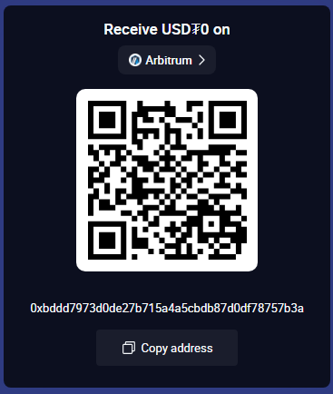
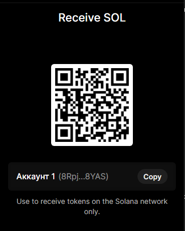

<<<<<<< Updated upstream
*If this research helped you, please consider giving it a ⭐ Star.*

## 🚀 Stay Updated
Found this research useful?
* **Star ⭐** this repo to keep track of it.
* **Follow me** on GitHub for more DeFi security research.
* **Fork** it if you want to run your own experiments.

### ☕ Support the Research
If you appreciate the work and want to support further security research:



**Wallet Address (ETH/EVM):**0xBDDD7973D0DE27B715A4A5cbdb87d0DF78757b3A 


**Solana:**8RpjaJQmCrRvKHMXA5ak4CrrLNJnJionwxMfTRG8YAS

> 📖 **Read the full development journey:** [Building an Atomic Arbitrage Bot on Base: From Zero to Live Trading](https://dev.to/rdin777/building-an-atomic-arbitrage-bot-on-base-from-zero-to-live-trading-2849)


=======
>>>>>>> Stashed changes
# 🚀 Base Arbitrage Project

Real-time DEX arbitrage detector + atomic execution smart contract on Base L2.

## 📦 Components

### 1. Atomic Arbitrage Smart Contract (`src/`)
Solidity smart contract that executes atomic arbitrage using EIP-3156 flash loans. No upfront capital required — borrow, swap, repay, and keep the profit in a single, atomic transaction.

**Features:**
- Flash loan integration (ERC3156)
- Atomic execution (all-or-nothing, zero risk of partial failure)
- Built and tested with Foundry
- Security-focused design (Checks-Effects-Interactions pattern)
- 6/6 unit tests passing

### 2. Arbitrage Detector Bot (`bot/`)
Lightweight TypeScript bot that monitors Uniswap V3 and Aerodrome pools on Base, calculates real net profit (fees + gas + slippage), and automatically triggers the smart contract when a profitable opportunity is found.

**Features:**
- Real-time WebSocket monitoring
- Net profit calculation
- Runs efficiently on minimal resources (1GB RAM)
- Built with modern `viem` stack

## 🛠️ Tech Stack

- **Smart Contract:** Solidity ^0.8.20, Foundry, OpenZeppelin v5
- **Bot:** TypeScript, Viem, Node.js
- **Network:** Base L2 (Mainnet & Sepolia Testnet)

## 🚀 Quick Start

### 2. Arbitrage Bot (`bot/`)
The TypeScript bot that detects opportunities and triggers the contract.
[See bot documentation](./bot/README.md)

### Prerequisites
- [Foundry](https://book.getfoundry.sh/getting-started/installation) installed
- Node.js 18+ and npm

### 1. Smart Contract
```bash
# Install dependencies
forge install

# Compile
forge build

# Run tests
forge test

# Run local fork (requires internet)
anvil --fork-url https://mainnet.base.org
<<<<<<< Updated upstream


### 2. Arbitrage Bot
cd bot
npm install

# Create .env file (see DEPLOYMENT.md)
cp .env.example .env

# Start the bot
npm run start

📊 Project Stats
140+ clones in the first 2 weeks
83 unique developers exploring the code
Found live 0.57% spread during testing
📜 Documentation
For detailed deployment instructions, environment setup, and local testing, see DEPLOYMENT.md.
Contributing
Contributions, issues, and feature requests are welcome! Feel free to check the issues page.
📄 License
This project is licensed under the MIT License.

=======
>>>>>>> Stashed changes
